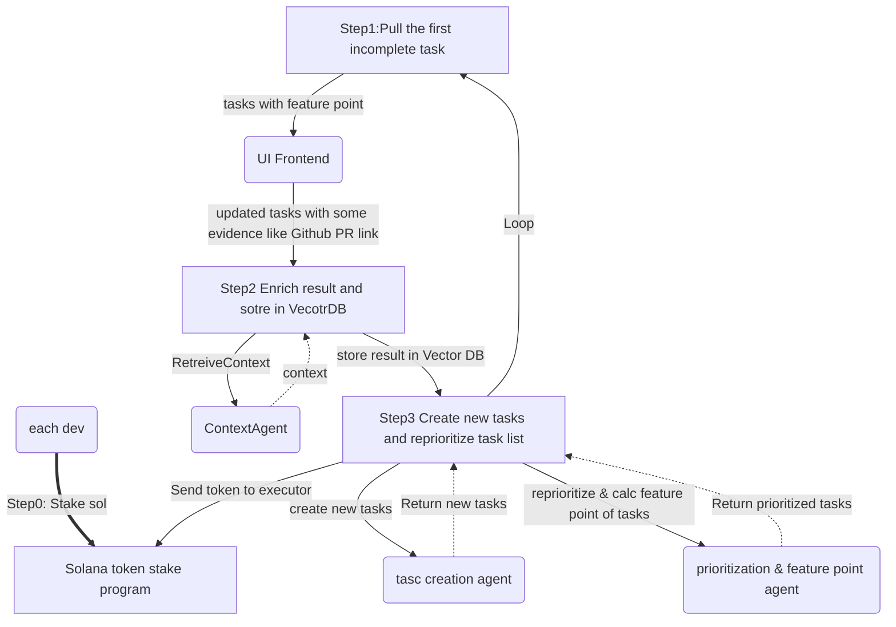
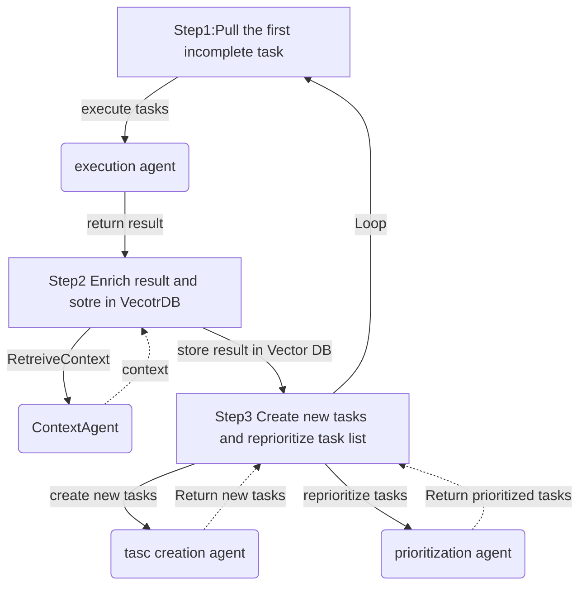

## taskmon architecture flow.

```mermaid
flowchart TD
    Z(each dev)==>|Step0: Stake sol|Y[Solana token stake program]
    A[Step1:Pull the first incomplete task] -->|tasks with feature point| B(UI Frontend)
    B -->|updated tasks with some evidence like Github PR link| C[Step2 Enrich result and sotre in VecotrDB]
    C -->|RetreiveContext| D(ContextAgent)
    D -.-> |context| C
    C -->|store result in Vector DB| E[Step3 Create new tasks and reprioritize task list]
    E -->|Send token to executor|Y
    E -->|Loop|A
    E -->|create new tasks| F(tasc creation agent)
    F -.->|Return new tasks|E
    E -->|reprioritize & calc feature point of tasks| G(prioritization & feature point agent)
    G -.->|Return prioritized tasks|E   
```

## Reference: Original BabyAGI architecture flow.
https://github.com/yoheinakajima/babyagi

```mermaid
flowchart TD
    A[Step1:Pull the first incomplete task] -->|execute tasks| B(execution agent)
    B -->|return result| C[Step2 Enrich result and sotre in VecotrDB]
    C -->|RetreiveContext| D(ContextAgent)
    D -.-> |context| C
    C -->|store result in Vector DB| E[Step3 Create new tasks and reprioritize task list]
    E -->|Loop|A
    E -->|create new tasks| F(tasc creation agent)
    F -.->|Return new tasks|E
    E -->|reprioritize tasks| G(prioritization agent)
    G -.->|Return prioritized tasks|E   
```